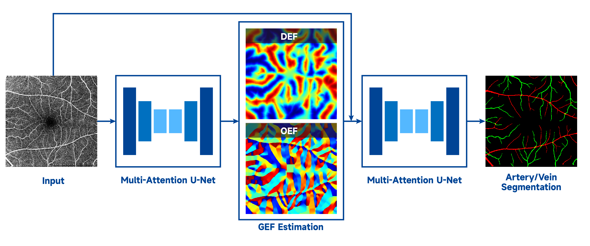

# Improving Retinal Artery-Vein Segmentation via Geometric Energy Fields

This repository contains the official PyTorch implementation of the paper:

**"Improving Retinal Artery-Vein Segmentation via Geometric Energy Fields"**  
*Mingchao Li, Wenbo Zhang, Zhilin Zhou, Yizhe Zhang, Qiang Chen, Junyu Dong*

---

## 🧠 Overview

We propose a **Geometric Energy Field (GEF)** supervision framework to enhance the robustness and structural consistency of retinal artery/vein (A/V) segmentation. The framework introduces two complementary geometric energy fields:

- **Distance Energy Field (DEF):** Encodes soft spatial territories for arteries and veins.
- **Orientation Energy Field (OEF):** Models vessel elongation and directional continuity.

These geometry-aware energy fields provide explicit supervision beyond local appearance cues, leading to more coherent and clinically plausible A/V segmentation.


---

## 📂 Project Structure

```
GEFAV/
├── data/                  Dataset directories (images, labels, energy fields)
├── logs/
│   ├── best_model         Best trained models saved here
│   ├── checkpoints        Model checkpoints per epoch
├── models/
│   ├── MAUNet2.py          2-stage multi-attention U-Net(Main GEF network)
│   ├── MAUNet.py           multi-attention U-Net
├── options/
│   ├── base_options.py    Shared configuration
│   ├── train_options.py   Training configuration
│   ├── test_options.py    Testing configuration
├── BatchDataReader.py     Dataset reader with augmentation
├── utils.py               Utility functions, metrics computation
├── GEF.py                 Energy field generation (DEF + OEF)
├── train.py               Training script
├── test.py                Testing script
└── README.md
```

---

## ✨ Key Features

### 🔧 Energy Field Generation
- **DEF:** Distance-based energy fields with multiple formulations (Gaussian, linear, exponential, inverse).  
- **OEF:** Orientation-based energy fields using cosine or angle encoding.  
- Automatic generation and saving of energy maps for arteries, veins, and mixed channels.

### 📊 Data Pipeline
- Supports multi-modal input, multi-label segmentation, and energy maps.  
- Synchronized geometric and photometric data augmentation.  
- Efficient batch loading with prefetching.

### 📈 Evaluation Framework
- **Pixel-level metrics:** Dice, Accuracy, Sensitivity, Specificity.  

- **Structure-level metrics:** clDice, HD95, INF, COR.  

- Comprehensive outputs: binary masks, RGB visualizations, and energy maps.

---

## ⚙️ Installation

### Dependencies

Tested with **Python 3.10+**:

```
torch >= 2.1
numpy >= 1.24
opencv-python >= 4.8
scikit-image >= 0.21
scipy >= 1.11
albumentations >= 1.3
tqdm >= 4.66
pandas >= 2.0
prefetch_generator >= 1.0
natsort >= 8.4
torchsummary >= 1.5
```

Install via pip:

```bash
pip install torch numpy opencv-python scikit-image scipy \
            albumentations tqdm pandas prefetch_generator \
            natsort torchsummary
```

---

## 🚀 Usage

### Step 1: Generate Energy Fields
Before training, generate DEF and OEF maps from binary vessel masks:

```bash
python GEF.py
```

This will create the following directories under your data folder:

- `DEF_A/`, `DEF_V/`, `DEF_M/` — Distance energy fields  
- `OEF_A/`, `OEF_V/`, `OEF_M/` — Orientation energy fields  

### Step 2: Training

Train the GEF model:

```bash
python train.py --trainroot ./data/train --testroot ./data/val --saveroot ./logs
```

**Training process:**

- Alternates between segmentation and energy regression phases.  
- Checkpoints saved in `logs/checkpoints/`.  
- Best model saved in `logs/best_model/`.

### Step 3: Testing & Inference

Evaluate the trained model:

```bash
python test.py --testroot ./data/test --saveroot ./logs
```

**Outputs:**

- Binary masks: `saveroot/test_results/artery/`, `saveroot/test_results/vein/`  
- RGB visualizations: `saveroot/test_visuals/`  
- Energy maps: `saveroot/test_results/energy/`  
- Evaluation summary: `saveroot/all_datasets_summary.csv`

---

## ⚙️ Configuration

All training and testing parameters are configurable through the `options/` directory:

| File                  | Description                                      |
|-----------------------|--------------------------------------------------|
| `base_options.py`     | Shared dataset, channels, and path configurations |
| `train_options.py`    | Training-specific parameters (batch size, epochs, optimizer) |
| `test_options.py`     | Testing-specific parameters (thresholds, dataset selection) |

Key configurable parameters include:

- Energy field types (DEF/OEF)  
- Network architecture choices  
- Loss function weights  
- Data augmentation settings  
- Evaluation metrics selection

## 📊 Results

Below are comparison results demonstrating the effectiveness of our proposed Geometric Energy Field (GEF) framework.


